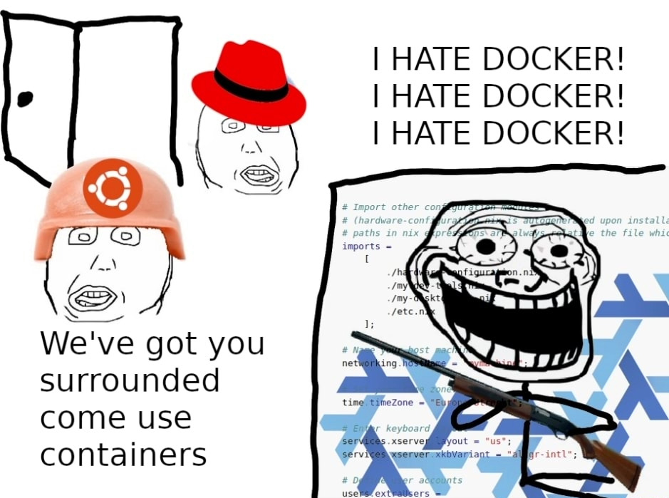
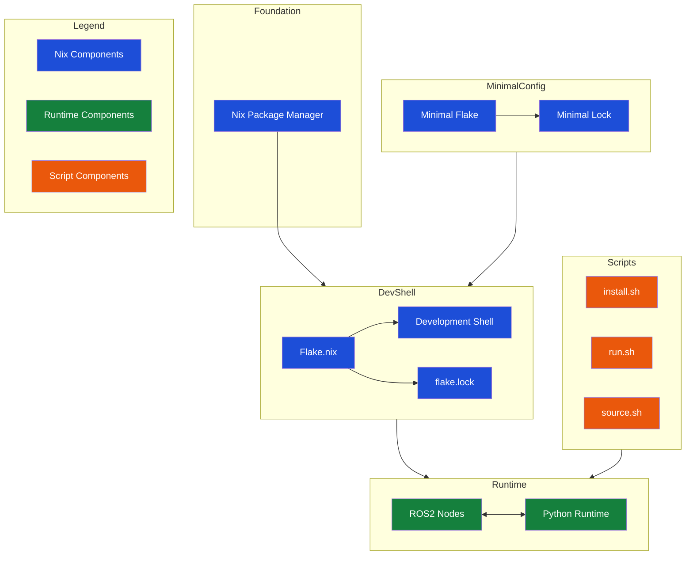

# Arcturus Nix :shipit:

The easiest way to get started with development on all_seaing_vehicle with native performance, powered by the Nix package manager

## A quick introduction



And so it begins…

## Technical overview



Generated with [GitDiagram](https://gitdiagram.com/arcturusnavigation/arcturus_nix).

## Getting up and running (in less than a minute)

> [!IMPORTANT]
> See [what is and isn't supported](#what-is-and-isnt-supported) for more information.

Run the following in a Bash shell on a Linux-based system to build individual Python nodes (simulations and nodes requiring YOLO models will not work).
Use this if you want to be on the bleeding edge of development, build code fast and cut through bloat, and get a taste of [NixOS god complex](https://www.reddit.com/r/NixOS/comments/kauf1m/dealing_with_post_nixflake_god_complex/).
Full reproducibility is [theoretically guaranteed](https://github.com/ArcturusNavigation/fish-n-ships), and dependency specifications, environment setup, and the like are much clearer and easier to change in Nix than in a Docker container.

Do not use this if you don't like Linux, hate Nix, don't like cutting edge technology, and don't want to be part of the software revolution.
You can [run from Nix](https://github.com/ArcturusNavigation/arcturus_docker), but [you can't hide](https://www.reddit.com/r/Nix/comments/19a2vqq/anyone_else_replacing_docker_compose_with_nix/).

1. Install the [Nix package manager](https://github.com/DeterminateSystems/nix-installer) (if you install from another source, [make sure flakes are enabled](https://nixos.wiki/wiki/Flakes#Other_Distros,_without_Home-Manager)—scroll up for NixOS-specific instructions)
2. Run this in a Bash shell wherever you want to clone this repository:

```bash
git clone https://github.com/ArcturusNavigation/arcturus_nix
cd arcturus_nix
nix develop
chmod +x ./install.sh
./install.sh
```

If you are on a resource-constrained system, suffer in silence while your computer attempts to build the entirety of the Arcturus ROS codebase and its dependencies from source—this may take a while.
Work is currently underway to automate this using a locally-hosted build server, but in the meantime enjoy the [Gentoo user experience](https://wiki.gentoo.org/wiki/Why_build_from_sources).

3. The last line of the install script should tell you how to run your first node. It should be (note the period):

```bash
. run.sh module_name node.py
```

Alternatively, you can simply add all modules to the build path so ROS can run them (`run.sh` does this automatically, but use the below command if you don't want to run any specific node initially):

```bash
. source.sh
```

4. Make sure you run the above command (and any other commands related to running and building nodes) from a Nix devshell (i.e. run `nix develop` prior to running any of these commands). Cloning this repository and updating dependencies are exceptions to this rule (see below).
5. To update your local environment, run this from the `arcturus_nix` directory:

```bash
git pull
nix flake update
nix develop
```

6. In general, after completing steps 1-2, you can run a module for the first time (since entering a devshell) using the command in step 3 and later with:

```bash
ros2 run module_name node.py
```

Other ROS commands (like `ros launch`) will work too.
You can manage the source code for all_seaing_vehicle in `dev_ws/src/all_seaing_vehicle`.

## Development

For those interested in contributing to this repository (that is, the build repository for `all_seaing_vehicle`), note that there is a secondary development shell `dev` that can be launched like so:

```sh
nix develop .#dev
```

This features pre-commit hooks with automatic formatting, among other things.
We also have a `.envrc` file to enable this shell automatically with [direnv](https://direnv.net/).
This is *not* the shell you should be using for building `all_seaing_vehicle` (that is `default`).

## FAQs

### I have an error running command X. What should I do?

[File an issue](https://github.com/ArcturusNavigation/arcturus_nix/issues/new) as soon as possible so we can fix it.
In the meantime, you can downgrade to the [Docker container](https://github.com/ArcturusNavigation/arcturus_docker), but the issues should be resolved very soon.

### Why should I use this instead of the Docker container?

As of right now, this setup does not offer a huge advantage over Docker, but it does have some important benefits.
Most notably, you don't have to deal with the virtualization (and jank) of Docker (you might even be able to use your GPU!), so builds should be much faster.
You also get the elegance of Nix, which makes it clear what packages you need as dependencies and what versions of those packages you need, for each module and for the system as a whole.
Nix does this in a much better and more reproducible way than ROS, but, currently, due to the devshell setup, it is impossible to determine whether all necessary packages are included in the Nix environment or if they are configured correctly.

### What is and isn't supported?

Currently, only Python nodes on Linux-based systems have been tested.
Other systems may not work.
Building almost all nodes intended for local testing (those in paths like `module_name/module_name/node.py`) is supported.
YOLO models and nodes that depend on them, however, are not supported.
Neither is Gazebo (VRX) simulation supported.
Both of these are planned for the future, but omitted for now due to excess bloat that would cause an unsustainable influx of jank in the Nix build process at this stage in its development.
All nodes should have their dependencies specified, but if a node that isn't listed as unsupported does not build, please [file an issue](https://github.com/ArcturusNavigation/arcturus_nix/issues/new).

### Is it any good?

[Yes, very](https://news.ycombinator.com/item?id=3067434).
